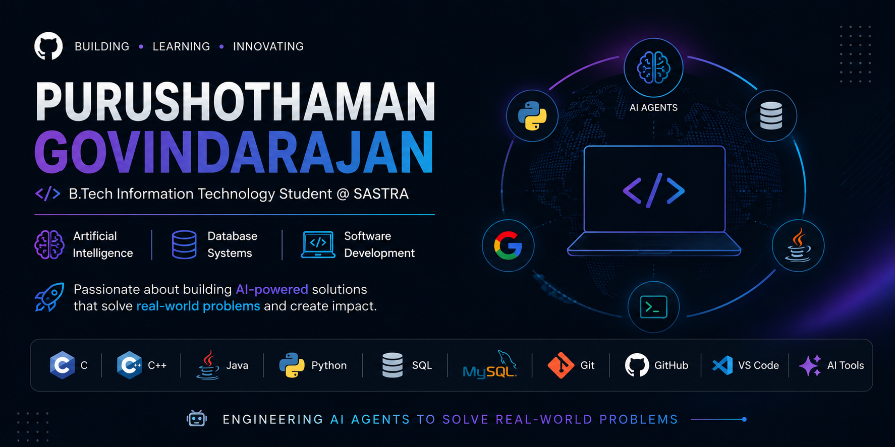

  

# Hi there, I'm Purushothaman Govindarajan 👋

🎓 **B.Tech Information Technology Student** @ SASTRA Deemed University (2028)  
💡 Passionate about **Artificial Intelligence, Database Systems, and Software Development**

---

## 🚀 About Me

- 🤖 Building AI-powered applications using **Google ADK, Gemini API, and Python**.
- 💻 Interested in **Artificial Intelligence, Database Systems, and Software Development**.
- 🌱 Currently learning **Linux Systems Programming, Shell Scripting, and Django** to strengthen my software development skills.
- 🚀 Passionate about building impactful software and AI solutions.

---

## 🛠️ Tech Stack

### Languages
- C
- C++
- Java
- Python
- SQL

### AI & Tools
- Google ADK
- Gemini API
- GitHub Copilot
- Prompt Engineering
- Git & GitHub
- VS Code

### Databases
- MySQL

---

## 🌟 Featured Projects

### 🤖 [AI Internship & Career Mentor Agent](https://github.com/purushothaman36662-gif/AI-Internship-Career-Mentor-Agent)

> Multi-agent AI application that provides **internship recommendations, personalized career roadmaps, and interview guidance** using **Google ADK**, **Gemini API**, and **MCP**.

`Python` • `Google ADK` • `Gemini API` • `MCP`

### 🎤 AI Interview Simulator *(Coming Soon)*

> AI-powered interview practice platform that generates personalized interview questions and provides constructive feedback to help users improve their interview skills.

---

## 📫 Connect with Me

- 💼 LinkedIn: [Purushothaman Govindarajan](https://www.linkedin.com/in/purushothaman-govindarajan-7573992b5/)
- 📧 Email: [purushothaman36662@gmail.com](mailto:purushothaman36662@gmail.com)

---

> 🤖 Engineering AI agents to solve real-world problems.
